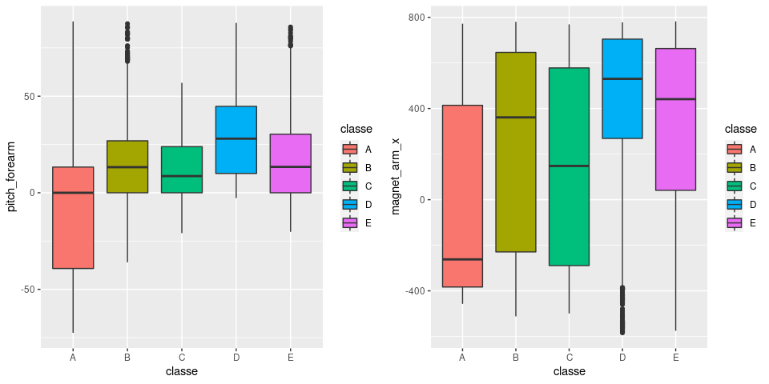

## Executive Summary

Based on the dataset available under HAR [http://groupware.les.inf.puc-rio.br/har](http://groupware.les.inf.puc-rio.br/har). I try training a predictive model to learn the exercises performed using 159 features

The following steps are executed:

- Data Processing
- Data Exploration 
- Model Selection
- Model Evaluation
- Final Insights

## Data Processing

First, I change 'am' to  factor (0 = automatic, 1 = manual)
And make cylinders a factor as well (since it is not continious)


```r
training.raw <- read.csv("pml-training.csv")
testing.raw <- read.csv("pml-testing.csv")
```

## Data Exploration 

Look at the dimensions & head of the data

```r
# Res 1
dim(training.raw)
```

```
## [1] 19622   160
```

What I see is a lot of data with NA / empty values, for this reason, I remove them


```r
maxNAPerc = 20
maxNACount <- nrow(training.raw) / 100 * maxNAPerc
removeColumns <- which(colSums(is.na(training.raw) | training.raw=="") > maxNACount)
training.cleaned01 <- training.raw[,-removeColumns]
testing.cleaned01 <- testing.raw[,-removeColumns]
```

Also I remove all time related data


```r
removeColumns <- grep("timestamp", names(training.cleaned01))
training.cleaned02 <- training.cleaned01[,-c(1, removeColumns )]
testing.cleaned02 <- testing.cleaned01[,-c(1, removeColumns )]
```

Then convert the factors to integers


```r
classeLevels <- levels(training.cleaned02$classe)
training.cleaned03 <- data.frame(data.matrix(training.cleaned02))
training.cleaned03$classe <- factor(training.cleaned03$classe, labels=classeLevels)
testing.cleaned03 <- data.frame(data.matrix(testing.cleaned02))
```

Finally, I make the data available


```r
training.cleaned <- training.cleaned03
testing.cleaned <- testing.cleaned03
```

## Model Selection

Since the test-set is the the validation-set, I split the current training into a test and train sets


```r
set.seed(19791108)
library(caret)

classeIndex <- which(names(training.cleaned) == "classe")

partition <- createDataPartition(y=training.cleaned$classe, p=0.75, list=FALSE)
training.subSetTrain <- training.cleaned[partition, ]
training.subSetTest <- training.cleaned[-partition, ]
```

Let's find the most correlated fields in the dataset


```r
correlations <- cor(training.subSetTrain[, -classeIndex], as.numeric(training.subSetTrain$classe))
bestCorrelations <- subset(as.data.frame(as.table(correlations)), abs(Freq)>0.3)
bestCorrelations
```

```
##             Var1 Var2     Freq
## 44 pitch_forearm    A 0.336018
```

Even the best correlations with classes are hardly above 0.3


```r
library(Rmisc)
library(ggplot2)

p1 <- ggplot(training.subSetTrain, aes(classe,pitch_forearm)) + 
  geom_boxplot(aes(fill=classe))

p2 <- ggplot(training.subSetTrain, aes(classe, magnet_arm_x)) + 
  geom_boxplot(aes(fill=classe))

multiplot(p1,p2,cols=2)
```

<!-- -->

Look at the graph, there is no hard separation of classes possible using only these 'highly' correlated features

## Model Evaluation

Let's identify variables with high correlations


```r
library(corrplot)
correlationMatrix <- cor(training.subSetTrain[, -classeIndex])
highlyCorrelated <- findCorrelation(correlationMatrix, cutoff=0.9, exact=TRUE)
excludeColumns <- c(highlyCorrelated, classeIndex)
corrplot(correlationMatrix, method="color", type="lower", order="hclust", tl.cex=0.70, tl.col="black", tl.srt = 45, diag = FALSE)
```

<!-- -->

We observe that some features are correlated to others


```r
pcaPreProcess.all <- preProcess(training.subSetTrain[, -classeIndex], method = "pca", thresh = 0.99)
training.subSetTrain.pca.all <- predict(pcaPreProcess.all, training.subSetTrain[, -classeIndex])
training.subSetTest.pca.all <- predict(pcaPreProcess.all, training.subSetTest[, -classeIndex])
testing.pca.all <- predict(pcaPreProcess.all, testing.cleaned[, -classeIndex])


pcaPreProcess.subset <- preProcess(training.subSetTrain[, -excludeColumns], method = "pca", thresh = 0.99)
training.subSetTrain.pca.subset <- predict(pcaPreProcess.subset, training.subSetTrain[, -excludeColumns])
training.subSetTest.pca.subset <- predict(pcaPreProcess.subset, training.subSetTest[, -excludeColumns])
testing.pca.subset <- predict(pcaPreProcess.subset, testing.cleaned[, -classeIndex])
```

Let's train using random forests


```r
library(randomForest)

ntree <- 200 #This is enough for great accuracy (trust me, I'm an engineer). 

start <- proc.time()
rfMod.cleaned <- randomForest(
  x=training.subSetTrain[, -classeIndex], 
  y=training.subSetTrain$classe,
  xtest=training.subSetTest[, -classeIndex], 
  ytest=training.subSetTest$classe, 
  ntree=ntree,
  keep.forest=TRUE,
  proximity=TRUE) #do.trace=TRUE
proc.time() - start
```

```
##    user  system elapsed 
##  80.838   1.760  82.601
```

```r
start <- proc.time()
rfMod.exclude <- randomForest(
  x=training.subSetTrain[, -excludeColumns], 
  y=training.subSetTrain$classe,
  xtest=training.subSetTest[, -excludeColumns], 
  ytest=training.subSetTest$classe, 
  ntree=ntree,
  keep.forest=TRUE,
  proximity=TRUE) #do.trace=TRUE
proc.time() - start
```

```
##    user  system elapsed 
##  79.233   2.212  81.454
```

```r
start <- proc.time()
rfMod.pca.all <- randomForest(
  x=training.subSetTrain.pca.all, 
  y=training.subSetTrain$classe,
  xtest=training.subSetTest.pca.all, 
  ytest=training.subSetTest$classe, 
  ntree=ntree,
  keep.forest=TRUE,
  proximity=TRUE) #do.trace=TRUE
proc.time() - start
```

```
##    user  system elapsed 
##  79.010   2.492  83.601
```

```r
start <- proc.time()
rfMod.pca.subset <- randomForest(
  x=training.subSetTrain.pca.subset, 
  y=training.subSetTrain$classe,
  xtest=training.subSetTest.pca.subset, 
  ytest=training.subSetTest$classe, 
  ntree=ntree,
  keep.forest=TRUE,
  proximity=TRUE) #do.trace=TRUE
proc.time() - start
```

```
##    user  system elapsed 
##  77.648   3.295  88.088
```

## Final Insights

Now that we have 4 trained models, let's check the effectiveness using accuracy 


```r
rfMod.cleaned
```

```
## 
## Call:
##  randomForest(x = training.subSetTrain[, -classeIndex], y = training.subSetTrain$classe,      xtest = training.subSetTest[, -classeIndex], ytest = training.subSetTest$classe,      ntree = ntree, proximity = TRUE, keep.forest = TRUE) 
##                Type of random forest: classification
##                      Number of trees: 200
## No. of variables tried at each split: 7
## 
##         OOB estimate of  error rate: 0.28%
## Confusion matrix:
##      A    B    C    D    E  class.error
## A 4184    0    0    0    1 0.0002389486
## B    5 2841    2    0    0 0.0024578652
## C    0   10 2557    0    0 0.0038955980
## D    0    0   17 2395    0 0.0070480929
## E    0    0    0    6 2700 0.0022172949
##                 Test set error rate: 0.31%
## Confusion matrix:
##      A   B   C   D   E class.error
## A 1395   0   0   0   0 0.000000000
## B    4 942   3   0   0 0.007376185
## C    0   2 853   0   0 0.002339181
## D    0   0   1 802   1 0.002487562
## E    0   0   0   4 897 0.004439512
```

```r
rfMod.cleaned.training.acc <- round(1-sum(rfMod.cleaned$confusion[, 'class.error']),3)
paste0("Accuracy on training: ",rfMod.cleaned.training.acc)
```

```
## [1] "Accuracy on training: 0.984"
```

```r
rfMod.cleaned.testing.acc <- round(1-sum(rfMod.cleaned$test$confusion[, 'class.error']),3)
paste0("Accuracy on testing: ",rfMod.cleaned.testing.acc)
```

```
## [1] "Accuracy on testing: 0.983"
```

```r
rfMod.exclude
```

```
## 
## Call:
##  randomForest(x = training.subSetTrain[, -excludeColumns], y = training.subSetTrain$classe,      xtest = training.subSetTest[, -excludeColumns], ytest = training.subSetTest$classe,      ntree = ntree, proximity = TRUE, keep.forest = TRUE) 
##                Type of random forest: classification
##                      Number of trees: 200
## No. of variables tried at each split: 6
## 
##         OOB estimate of  error rate: 0.28%
## Confusion matrix:
##      A    B    C    D    E  class.error
## A 4184    1    0    0    0 0.0002389486
## B    4 2842    2    0    0 0.0021067416
## C    0   12 2555    0    0 0.0046747176
## D    0    0   15 2396    1 0.0066334992
## E    0    0    0    6 2700 0.0022172949
##                 Test set error rate: 0.29%
## Confusion matrix:
##      A   B   C   D   E class.error
## A 1395   0   0   0   0 0.000000000
## B    2 945   2   0   0 0.004214963
## C    0   4 851   0   0 0.004678363
## D    0   0   3 800   1 0.004975124
## E    0   0   0   2 899 0.002219756
```

```r
rfMod.exclude.training.acc <- round(1-sum(rfMod.exclude$confusion[, 'class.error']),3)
paste0("Accuracy on training: ",rfMod.exclude.training.acc)
```

```
## [1] "Accuracy on training: 0.984"
```

```r
rfMod.exclude.testing.acc <- round(1-sum(rfMod.exclude$test$confusion[, 'class.error']),3)
paste0("Accuracy on testing: ",rfMod.exclude.testing.acc)
```

```
## [1] "Accuracy on testing: 0.984"
```

```r
rfMod.pca.all
```

```
## 
## Call:
##  randomForest(x = training.subSetTrain.pca.all, y = training.subSetTrain$classe,      xtest = training.subSetTest.pca.all, ytest = training.subSetTest$classe,      ntree = ntree, proximity = TRUE, keep.forest = TRUE) 
##                Type of random forest: classification
##                      Number of trees: 200
## No. of variables tried at each split: 6
## 
##         OOB estimate of  error rate: 2.08%
## Confusion matrix:
##      A    B    C    D    E class.error
## A 4162   11    1    8    3 0.005495818
## B   49 2775   18    2    4 0.025632022
## C    5   30 2509   21    2 0.022594468
## D    3    1  100 2300    8 0.046434494
## E    1    7   14   18 2666 0.014781966
##                 Test set error rate: 1.71%
## Confusion matrix:
##      A   B   C   D   E class.error
## A 1387   4   0   3   1 0.005734767
## B   14 930   5   0   0 0.020021075
## C    1  11 836   6   1 0.022222222
## D    1   0  23 777   3 0.033582090
## E    0   0   7   4 890 0.012208657
```

```r
rfMod.pca.all.training.acc <- round(1-sum(rfMod.pca.all$confusion[, 'class.error']),3)
paste0("Accuracy on training: ",rfMod.pca.all.training.acc)
```

```
## [1] "Accuracy on training: 0.885"
```

```r
rfMod.pca.all.testing.acc <- round(1-sum(rfMod.pca.all$test$confusion[, 'class.error']),3)
paste0("Accuracy on testing: ",rfMod.pca.all.testing.acc)
```

```
## [1] "Accuracy on testing: 0.906"
```

```r
rfMod.pca.subset
```

```
## 
## Call:
##  randomForest(x = training.subSetTrain.pca.subset, y = training.subSetTrain$classe,      xtest = training.subSetTest.pca.subset, ytest = training.subSetTest$classe,      ntree = ntree, proximity = TRUE, keep.forest = TRUE) 
##                Type of random forest: classification
##                      Number of trees: 200
## No. of variables tried at each split: 6
## 
##         OOB estimate of  error rate: 2.43%
## Confusion matrix:
##      A    B    C    D    E class.error
## A 4155    8    9   10    3 0.007168459
## B   69 2741   29    5    4 0.037570225
## C    2   33 2510   20    2 0.022204908
## D    7    3  104 2292    6 0.049751244
## E    2    9   20   13 2662 0.016260163
##                 Test set error rate: 1.96%
## Confusion matrix:
##      A   B   C   D   E class.error
## A 1387   3   2   3   0 0.005734767
## B   18 924   7   0   0 0.026343519
## C    0  12 838   4   1 0.019883041
## D    0   1  27 774   2 0.037313433
## E    1   3   9   3 885 0.017758047
```

```r
rfMod.pca.subset.training.acc <- round(1-sum(rfMod.pca.subset$confusion[, 'class.error']),3)
paste0("Accuracy on training: ",rfMod.pca.subset.training.acc)
```

```
## [1] "Accuracy on training: 0.867"
```

```r
rfMod.pca.subset.testing.acc <- round(1-sum(rfMod.pca.subset$test$confusion[, 'class.error']),3)
paste0("Accuracy on testing: ",rfMod.pca.subset.testing.acc)
```

```
## [1] "Accuracy on testing: 0.893"
```

This concludes that PCA is not positive. The `rfMod.exclude` performs slightly better than the 'rfMod.cleaned'

Let's keep the `rfMod.exclude` model as the best model to use for predicting the test-set.


```r
start <- proc.time()

library(RColorBrewer)
palette <- brewer.pal(length(classeLevels), "Set1")
rfMod.mds <- MDSplot(rfMod.exclude, as.factor(classeLevels), k=2, pch=20, palette=palette)
```

<!-- -->

```r
library(cluster)
rfMod.pam <- pam(1 - rfMod.exclude$proximity, k=length(classeLevels), diss=TRUE)

plot(
  rfMod.mds$points[, 1], 
  rfMod.mds$points[, 2], 
  pch=rfMod.pam$clustering+14, 
  col=alpha(palette[as.numeric(training.subSetTrain$classe)],0.5), 
  bg=alpha(palette[as.numeric(training.subSetTrain$classe)],0.2), 
  cex=0.5,
  xlab="x", ylab="y")
legend("bottomleft", legend=unique(rfMod.pam$clustering), pch=seq(15,14+length(classeLevels)), title = "PAM cluster")
  legend("topleft", legend=classeLevels, pch = 16, col=palette, title = "Classification")
```

<!-- -->

```r
proc.time() - start
```

```
##     user   system  elapsed 
## 4421.010   10.897 4484.630
```

The predictions don't really change a lot with each model, but since we have most faith in the `rfMod.exclude`, let's keep it~ as final answer for the assignment. 


